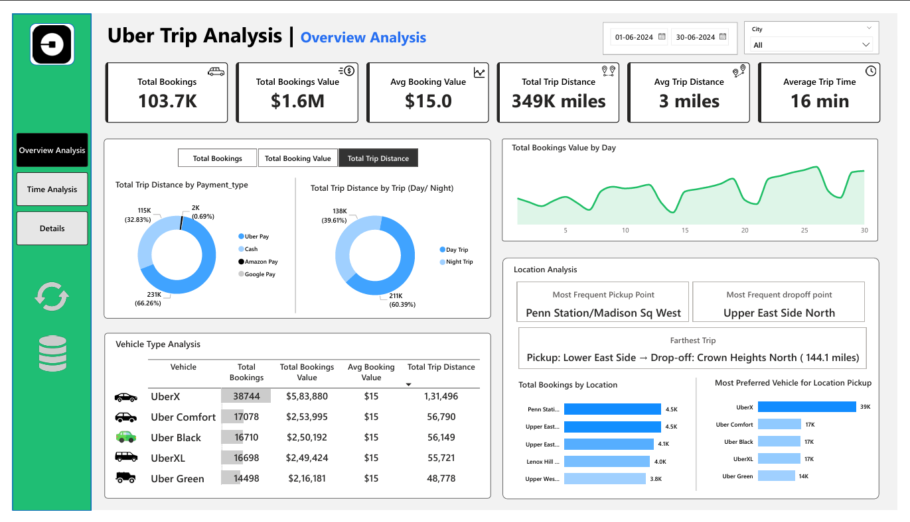
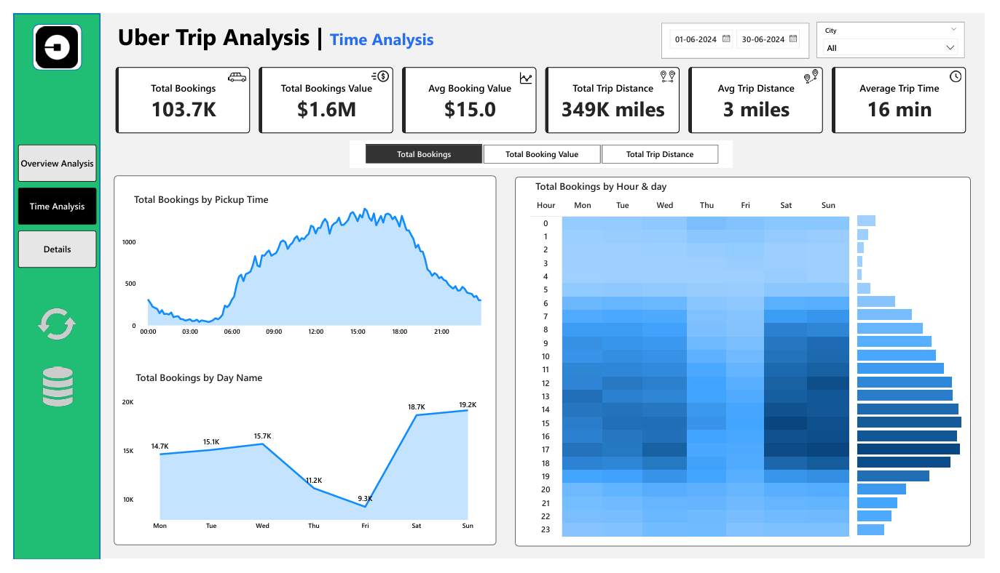
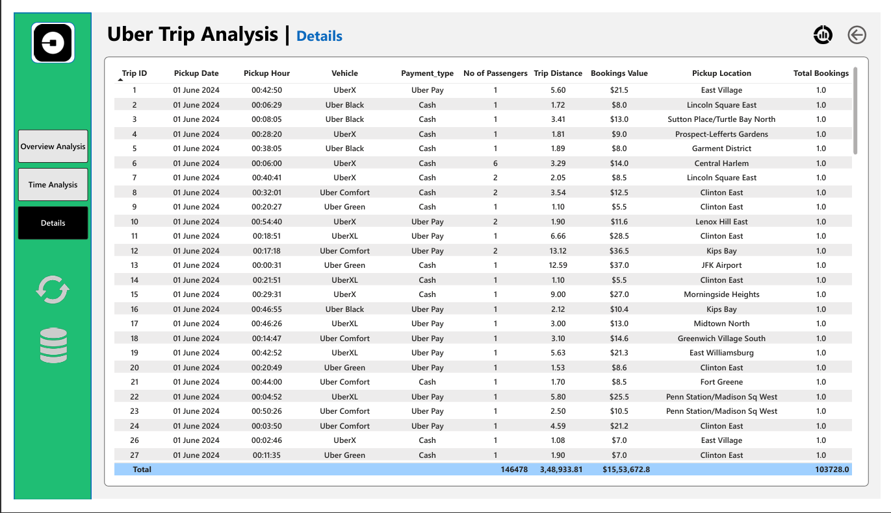
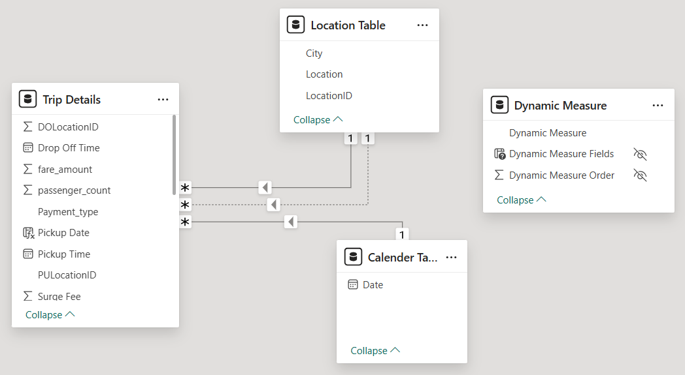

# 🚖 Uber Trip Analysis using Power BI

This project explores Uber trip data to uncover patterns in booking behavior, revenue, and trip efficiency. It helps stakeholders make data-driven decisions to improve operations and customer satisfaction.

---

## 📊 Dashboards Overview

### 📌 Dashboard 1: Overview Analysis
- KPIs: Total Bookings, Booking Value, Trip Distance, Average Duration
- Dynamic measure selector using disconnected table
- Filters: City, Date
- Vehicle Type grid with conditional formatting
- Location Analysis: Most frequent pickup/drop, farthest trip

---

### 📌 Dashboard 2: Time Analysis
- Area Chart: Bookings by 10-minute pickup intervals
- Line Chart: Bookings by Day of the Week
- Heatmap: Hourly booking trends (0–23 hrs vs Mon–Sun)

  

---

### 📌 Dashboard 3: Details Tab
- Drill-through to explore granular trip details
- Bookmark: View filtered data or full dataset
- Export/Download buttons for raw data (CSV/Excel)

---

### 📐 Data Model

Power BI data model designed with a **star schema** for clean relationships and performance:

- **Trip Details** (Fact Table): Contains fares, time, payment type, pickup/drop-off info.
- **Location Table**: Used for both pickup and drop-off (one inactive relationship).
- **Calendar Table**: Enables time-based slicing and analysis.
- **Dynamic Measure Table**: Disconnected table powering the measure selector.

---

## 🧩 Features Implemented
- ✅ Dynamic Titles
- ✅ Tooltips with additional KPIs
- ✅ Global Measure Selector
- ✅ Conditional Formatting in Grid
- ✅ Slicers: Date, City
- ✅ Drill-through with detailed grid view
- ✅ Reset slicers & download raw data using buttons

---

## 📦 Tools Used
- **Power BI Desktop**
- **Microsoft Excel**
- **Power Query**
- **Power Automate (for Export Button)**

---

## 📈 Key Insights
- Peak booking hours fall between 12 PM and 6 PM, indicating strong afternoon travel demand.
- Weekends see the highest ride volume, with Saturday and Sunday dominating bookings.
- Uber Pay is the most preferred payment method, used in over two-thirds of all trips.
- UberX is the most booked vehicle type, showing a strong preference for affordable standard rides.
- Night trips are fewer but cover longer distances, likely due to airport or late-night commutes.

---
## 💡 Project Impact
- Helps identify **peak booking hours**, **high-demand days**, and **preferred vehicle types**.
- Reveals top pickup and drop-off locations to improve **driver allocation** and **route planning**.
- Analyzes **revenue trends**, **booking behavior**, and **trip efficiency** to support pricing strategies.
- Showcases advanced Power BI features: **data modeling**, **dynamic measure selection**, **DAX calculations**, **drill-through navigation**, **bookmarks**, and **interactive UX**.
- Helps stakeholders make **data-driven decisions** for improving ride availability, customer satisfaction, and profitability.

---

## 📎 How to Use
1. Clone or download this repository.
2. Open `.pbix` files in Power BI Desktop.
3. Use slicers and measure selectors to explore data.
4. Use the “Details” tab for drilling through specific points.

---
## 🙋‍♀️ About Me
👤 **Akanksha Ghadage**  
🎯 Aspiring Data Analyst 

## Connect with Me

**[Linkedin](https://www.linkedin.com/in/akanksha-ghadage?lipi=urn%3Ali%3Apage%3Ad_flagship3_profile_view_base_contact_details%3BdlFNzzQrTAiOhMUx8JAUmA%3D%3D)**    &emsp; &emsp; &emsp; &emsp; &emsp; &emsp; &emsp; &emsp; &emsp;  **[GitHub](https://github.com/akanksha-ghadage)**
